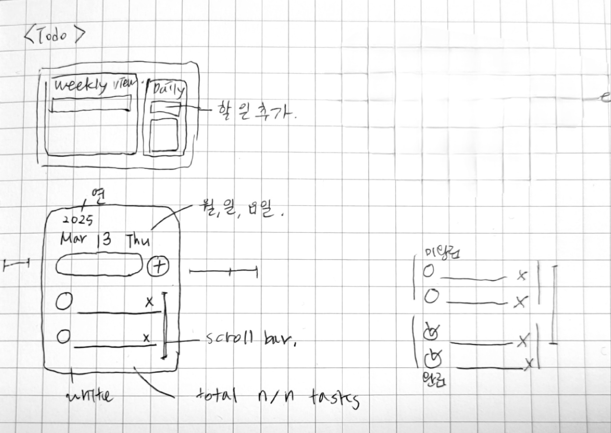
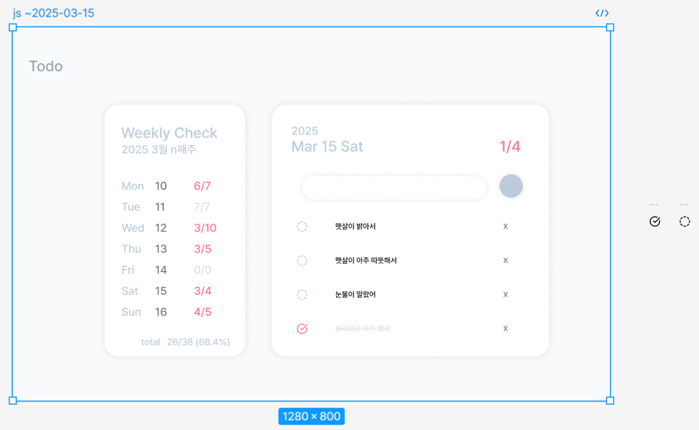

# 1주차 미션: Vanilla-Todo

# 서론

안녕하세요. 저는 21기 프론트엔드 **김영서**입니다😊  
바닐라 자바스크립트를 사용하여 To do list를 만들었습니다.

1. 와이어프레임 작성  
   
2. [피그마](https://www.figma.com/design/oUJT679EyBJYQmCJgNdgvJ/CEOS-Frontend-21-%EA%B9%80%EC%98%81%EC%84%9C?node-id=0-1&t=NApCyJNiTO7XhMKT-1) 작성  
   
3. 개발

**YS-Todo 기능**

1. 날짜를 클릭하여 날짜 선택 가능
2. task 완료 개수 / 전체 개수 표시
3. 추가 버튼, `Enter` 키를 이용한 task 추가 / X 버튼 삭제 / O 버튼 완료 체크
4. localStorage에 데이터 저장
5. Weekly로 날짜 이동
6. Weekly에서 한 주의 task 확인

# 미션

## 미션 목표

⭕️ VSCode, Prettier를 이용하여 개발 환경을 관리합니다.  
⭕️ HTML/CSS의 기초를 이해합니다.  
⭕️ JavaScript를 이용한 DOM 조작을 이해합니다.  
⭕️ Vanilla Js를 이용한 어플리케이션 상태 관리 방법을 이해합니다.

## Key Questions

- DOM은 무엇인가요?
- 이벤트 흐름 제어(버블링 & 캡처링)이 무엇인가요?
- 클로저와 스코프가 무엇인가요?

## 필수 요구사항

⭕️ [결과 화면](https://vanilla-todo-19th-dh.vercel.app/)의 기능을 구현
✅ 추가 버튼, `Enter` 키를 이용한 task 추가  
✅ task 삭제  
✅ task 체크 토글  
✅ task 개수  
✅ 날짜 표시 및 변경

⭕️ CSS의 Flexbox를 이용하여 레이아웃을 구성합니다.  
⭕️ 함수와 변수의 이름은 lowerCamelCase로 짓습니다.  
⭕️ 코딩의 단위를 기능별로 나누어 Commit 메세지를 작성합니다.  
⭕️ Semantic tag를 활용하여 HTML 구조를 완성합니다.  
✅ `<header>`, `<main>`, `<section>` 사용

## 선택 요구사항

⭕️ 외부 폰트 Pretendard를 적용합니다.  
⭕️ 브라우저의 `localStorage` 혹은 `sessionStorage`를 이용하여 다음 번 접속 시에 기존의 투두 데이터를 불러옵니다.  
✅ `sessionStorage`는 탭을 닫으면 사라지므로 다음 번 접속 시에도 기존 투두 데이터를 보기 위해 `localStorage` 사용

# 링크 및 참고자료

- [HTML/CSS 기초](https://heropy.blog/2019/04/24/html-css-starter/)
- [HTML 태그](https://heropy.blog/2019/05/26/html-elements/)
- [FlexBox 가이드](https://heropy.blog/2018/11/24/css-flexible-box/)
- [JS를 통한 DOM 조작](https://velog.io/@bining/javascript-DOM-%EC%A1%B0%EC%9E%91%ED%95%98%EA%B8%B0#append)
- [localStorage, sessionStorage](https://www.daleseo.com/js-web-storage/)
- [git 사용법](https://wayhome25.github.io/git/2017/07/08/git-first-pull-request-story/)
- [좋은 코드리뷰 방법](https://tech.kakao.com/2022/03/17/2022-newkrew-onboarding-codereview/)
- [MDN 공식문서-createElement()](https://developer.mozilla.org/en-US/docs/Web/API/Document/createElement)
- [MDN 공식문서-appendChild()](https://developer.mozilla.org/ko/docs/Web/API/Node/appendChild)
- [DOM 개념,HTML 요소 조작](https://poiemaweb.com/js-dom#3-dom-query--traversing-%EC%9A%94%EC%86%8C%EC%97%90%EC%9D%98-%EC%A0%91%EA%B7%BC)
